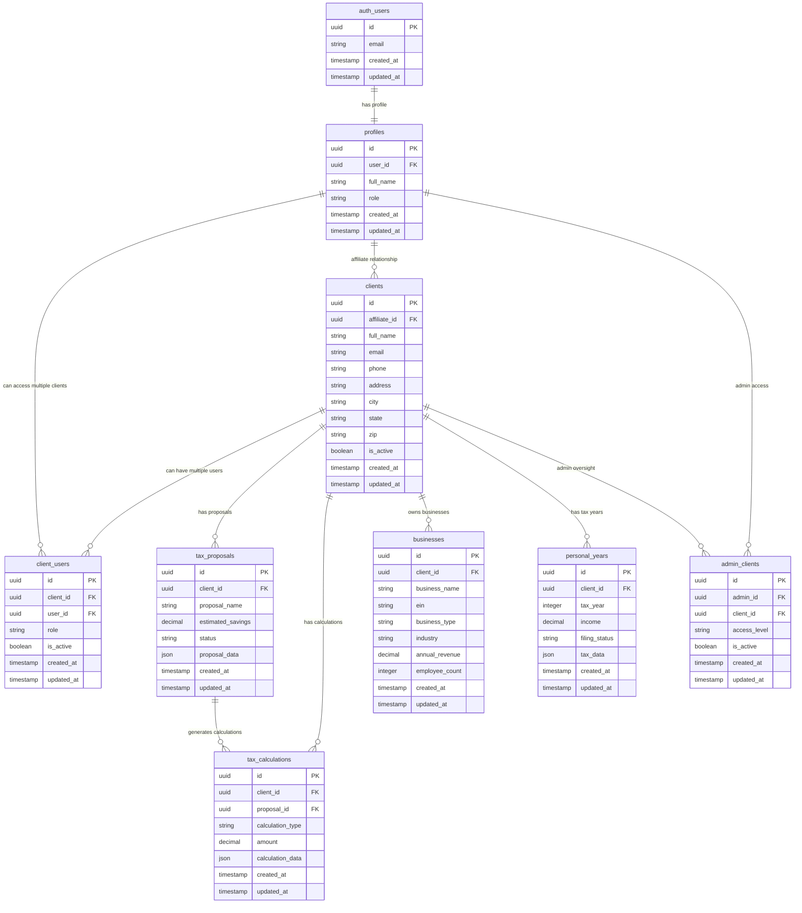

# Database Entity Relationship Diagram (ERD)

## Current Schema Overview
This ERD represents the database schema after applying all security hardening migrations (Epic 0).

## Key Relationships

### User Management
- **auth_users** ↔ **profiles**: One-to-one relationship for user authentication and profile data
- **profiles** ↔ **client_users**: Many-to-many through junction table for multi-client access
- **clients** ↔ **client_users**: Many-to-many allowing multiple users per client

### Client Hierarchy
- **profiles** (affiliates) ↔ **clients**: One-to-many relationship where affiliates can have multiple clients
- **clients** serve as the central entity connecting all client-related data

### Tax Data Structure
- **clients** ↔ **tax_proposals**: One-to-many for proposal management
- **clients** ↔ **tax_calculations**: One-to-many for all calculations
- **tax_proposals** ↔ **tax_calculations**: One-to-many linking proposals to their calculations
- **clients** ↔ **businesses**: One-to-many for business entities
- **clients** ↔ **personal_years**: One-to-many for personal tax years

### Administrative Access
- **admin_clients**: Junction table providing admin users oversight of specific clients
- Allows granular admin access control per client

## Security Features

### Row Level Security (RLS)
All tables implement RLS policies ensuring:
- Users can only access data for clients they're associated with
- Admins have appropriate oversight capabilities
- Affiliate users can access their clients' data
- Client users can only access their own client's data

### Data Isolation
- **client_id** serves as the primary isolation boundary
- All client-related data is properly scoped through foreign key relationships
- Junction tables ensure proper many-to-many relationships without data leakage

## Migration History
This schema represents the state after applying:
1. **Migration 0**: Add affiliate_id to clients
2. **Migration 1**: Create client_users junction table
3. **Migration 2**: Update client RLS policies
4. **Migration 3**: Security cleanup and policy refinement
5. **Migration 4**: Fix tax_proposals client relationship
6. **Migration 5**: Normalize all client relationships

## Helper Views and Functions

### Views
- **client_with_affiliate_info**: Joins clients with affiliate profile data
- **user_accessible_clients**: Shows which clients each user can access
- **admin_client_overview**: Provides admin view of client relationships

### Functions
- **get_user_clients()**: Returns clients accessible to current user
- **check_client_access()**: Validates user access to specific client
- **get_affiliate_clients()**: Returns clients for affiliate users

## Notes
- All foreign keys use UUID type for consistency
- Timestamps are automatically managed with triggers
- JSON columns store flexible data structures for extensibility
- Boolean flags control active/inactive states throughout the system 