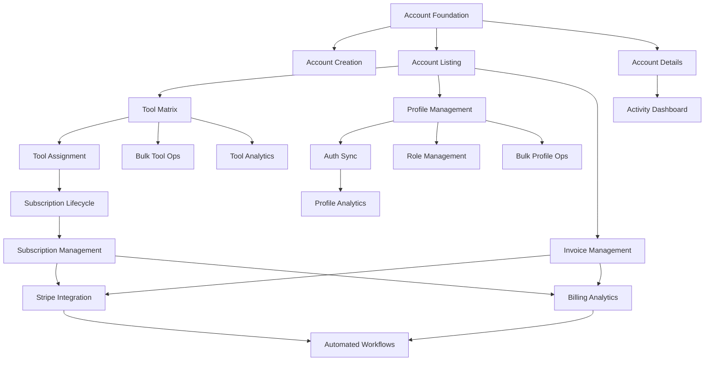

# Epic 3: Admin Platform Management - Development-Ready User Stories

**Battle Born Capital Advisors - Admin Platform Management System**

**Epic Duration**: 12 weeks (4 phases × 3 weeks each)  
**Total Stories**: 20 stories (5 per phase)  
**Story Points Range**: 1-13 (Fibonacci scale)  
**Target Team**: 2-3 developers + 1 QA engineer

---

## Executive Summary

This document provides 20 development-ready user stories for Epic 3 Admin Platform Management, organized across 4 phases. Each story includes acceptance criteria, technical requirements, definition of done, story points, dependencies, and testing specifications.

### Phase Overview
- **Phase 1**: Account Management Foundation (Weeks 1-3)
- **Phase 2**: Tool Management System (Weeks 4-6)
- **Phase 3**: Profile Management & Auth Sync (Weeks 7-9)
- **Phase 4**: Billing Integration & Analytics (Weeks 10-12)

### Story Point Distribution
- **1-3 points**: Simple CRUD operations, UI components
- **5-8 points**: Complex workflows, integrations
- **13 points**: Major system integrations, complex analytics

---

# PHASE 1: ACCOUNT MANAGEMENT (WEEKS 1-3)

## Story 1.1: Account Management Foundation & Database Setup

**Story ID**: EP3-1.1  
**Story Points**: 5  
**Sprint**: Week 1  
**Dependencies**: None (Foundation story)

### User Story
**As an** admin user  
**I want to** have a robust account management foundation with audit logging  
**So that** I can manage client accounts with full compliance tracking

### Acceptance Criteria
- [ ] Database schema created with account_activities table
- [ ] Automatic audit logging for all account modifications
- [ ] Performance indexes for efficient queries
- [ ] RLS policies for admin access control
- [ ] Activity logging service operational

### Technical Requirements
```sql
-- Database schema implementation
CREATE TABLE account_activities (
  id UUID PRIMARY KEY DEFAULT gen_random_uuid(),
  actor_id UUID REFERENCES profiles(id),
  account_id UUID REFERENCES accounts(id),
  activity_type VARCHAR NOT NULL,
  target_type VARCHAR NOT NULL,
  target_id UUID NOT NULL,
  description TEXT NOT NULL,
  metadata JSONB,
  created_at TIMESTAMP WITH TIME ZONE DEFAULT NOW()
);
```

### API Endpoints
- `POST /api/admin/accounts/:id/activities` - Log manual activity
- `GET /api/admin/accounts/:id/activities` - Get account activities

### Definition of Done
- [ ] Database migration scripts deployed and tested
- [ ] All account modifications trigger automatic logging
- [ ] Activity logging service passes unit tests
- [ ] RLS policies restrict access to admin users only
- [ ] Performance benchmarks meet requirements (< 100ms query time)

### Testing Requirements
- **Unit Tests**: Activity logging functionality, database triggers
- **Integration Tests**: End-to-end activity logging workflow
- **Performance Tests**: Activity queries with 10k+ records

---

## Story 1.2: Account Creation Wizard

**Story ID**: EP3-1.2  
**Story Points**: 8  
**Sprint**: Week 1-2  
**Dependencies**: EP3-1.1 (Database foundation)

### User Story
**As an** admin user  
**I want to** create new accounts through a guided wizard  
**So that** I can efficiently onboard new clients with proper data validation

### Acceptance Criteria
- [ ] Multi-step wizard with account type selection (client, affiliate, expert)
- [ ] Comprehensive form validation for required fields
- [ ] Integration with existing accounts schema
- [ ] Success confirmation with generated account ID
- [ ] Automatic activity logging for account creation
- [ ] Error handling with user-friendly messages

### Technical Requirements
```typescript
interface CreateAccountData {
  type: 'client' | 'affiliate' | 'expert';
  name: string;
  email: string;
  phone?: string;
  address: {
    street: string;
    city: string;
    state: string;
    zip: string;
  };
  metadata?: Record<string, any>;
}
```

### Component Architecture
```
src/modules/admin/components/accounts/
├── CreateAccountWizard.tsx
├── AccountTypeSelector.tsx
├── AccountInfoForm.tsx
├── AddressForm.tsx
└── CreateAccountSummary.tsx
```

### API Endpoints
- `POST /api/admin/accounts` - Create new account

### Definition of Done
- [ ] Wizard completes all account types successfully
- [ ] All form validation rules implemented and tested
- [ ] Account creation integrates with existing schema
- [ ] Activity logging captures account creation
- [ ] Unit tests cover all validation scenarios
- [ ] E2E tests verify complete wizard flow

### Testing Requirements
- **Unit Tests**: Form validation logic, wizard step transitions
- **Integration Tests**: Account creation with database, activity logging
- **E2E Tests**: Complete wizard workflow for all account types

---

## Story 1.3: Account Listing & Advanced Search

**Story ID**: EP3-1.3  
**Story Points**: 5  
**Sprint**: Week 2  
**Dependencies**: EP3-1.1 (Database foundation)

### User Story
**As an** admin user  
**I want to** view and search all accounts with advanced filtering  
**So that** I can efficiently locate and manage client accounts

### Acceptance Criteria
- [ ] Paginated table view with virtualization for large datasets
- [ ] Search by name, email, account type with real-time results
- [ ] Advanced filters: status, type, creation date range
- [ ] Sort by any column with persistent state
- [ ] Click-through to account details
- [ ] Export filtered results to CSV

### Technical Requirements
```typescript
interface AccountFilters {
  search?: string;
  accountType?: string[];
  status?: string[];
  createdAfter?: Date;
  createdBefore?: Date;
  sortBy?: string;
  sortOrder?: 'asc' | 'desc';
  page?: number;
  limit?: number;
}
```

### Performance Requirements
- Load 1000+ accounts in < 2 seconds
- Search results in < 500ms
- Virtualized scrolling for 10k+ records

### API Endpoints
- `GET /api/admin/accounts` - List accounts with filters

### Definition of Done
- [ ] Table displays all account data correctly
- [ ] Search and filters work as specified
- [ ] Pagination handles large datasets efficiently
- [ ] Export functionality generates accurate CSV
- [ ] Performance benchmarks met
- [ ] Responsive design works on all screen sizes

### Testing Requirements
- **Unit Tests**: Filter logic, search functionality
- **Integration Tests**: API integration with filtering
- **Performance Tests**: Large dataset handling, search speed

---

## Story 1.4: Account Details & Inline Editing

**Story ID**: EP3-1.4  
**Story Points**: 8  
**Sprint**: Week 2-3  
**Dependencies**: EP3-1.3 (Account listing), EP3-1.1 (Activity logging)

### User Story
**As an** admin user  
**I want to** view comprehensive account details and edit information inline  
**So that** I can maintain accurate client data and resolve issues efficiently

### Acceptance Criteria
- [ ] Comprehensive account information display
- [ ] Inline editing for all editable fields
- [ ] Real-time validation before saving changes
- [ ] Activity history timeline for the account
- [ ] Related profiles and tools display
- [ ] Optimistic updates with error rollback

### Technical Requirements
```typescript
interface AccountDetails {
  id: string;
  type: string;
  name: string;
  email: string;
  phone?: string;
  address: Address;
  status: string;
  createdAt: Date;
  updatedAt: Date;
  profiles: Profile[];
  toolAccess: ToolAccess[];
  activities: AccountActivity[];
  metadata: Record<string, any>;
}
```

### Component Architecture
```
src/modules/admin/components/accounts/
├── AccountDetailsPanel.tsx
├── InlineEditField.tsx
├── AccountActivityTimeline.tsx
├── RelatedProfilesList.tsx
└── RelatedToolsList.tsx
```

### API Endpoints
- `GET /api/admin/accounts/:id` - Get account details
- `PUT /api/admin/accounts/:id` - Update account

### Definition of Done
- [ ] All account information displays correctly
- [ ] Inline editing works for all fields
- [ ] Validation prevents invalid data entry
- [ ] Activity timeline shows complete history
- [ ] Related data (profiles, tools) displays correctly
- [ ] Optimistic updates provide immediate feedback

### Testing Requirements
- **Unit Tests**: Inline editing logic, validation rules
- **Integration Tests**: Account updates, activity logging
- **E2E Tests**: Complete account editing workflow

---

## Story 1.5: Account Activity Dashboard & Compliance Reporting

**Story ID**: EP3-1.5  
**Story Points**: 5  
**Sprint**: Week 3  
**Dependencies**: EP3-1.1 (Activity logging), EP3-1.4 (Account details)

### User Story
**As an** admin user  
**I want to** view comprehensive activity dashboards and generate compliance reports  
**So that** I can track all account changes and meet regulatory requirements

### Acceptance Criteria
- [ ] Activity dashboard with filterable timeline
- [ ] Search activities by type, date range, actor
- [ ] Export capabilities for compliance reporting (CSV, PDF)
- [ ] Real-time activity updates using WebSocket
- [ ] Activity aggregation and summary metrics
- [ ] Automated compliance report generation

### Technical Requirements
```typescript
interface ActivityDashboard {
  totalActivities: number;
  activitiesByType: Record<string, number>;
  activitiesByActor: Record<string, number>;
  recentActivities: AccountActivity[];
  dateRange: {
    start: Date;
    end: Date;
  };
}
```

### Export Capabilities
- CSV export with customizable columns
- PDF reports with company branding
- Scheduled report generation
- Email delivery of reports

### API Endpoints
- `GET /api/admin/activities/dashboard` - Activity dashboard data
- `POST /api/admin/activities/export` - Generate activity export
- `GET /api/admin/activities/reports` - Compliance reports

### Definition of Done
- [ ] Activity dashboard displays comprehensive data
- [ ] All filters and search functionality work
- [ ] Export generates accurate reports
- [ ] Real-time updates function properly
- [ ] Scheduled reports generate automatically
- [ ] Performance handles large activity volumes

### Testing Requirements
- **Unit Tests**: Dashboard calculations, export generation
- **Integration Tests**: Real-time updates, report accuracy
- **Performance Tests**: Dashboard with 50k+ activities

---

# PHASE 2: TOOL MANAGEMENT (WEEKS 4-6)

## Story 2.1: Tool Assignment Matrix

**Story ID**: EP3-2.1  
**Story Points**: 13  
**Sprint**: Week 4-5  
**Dependencies**: EP3-1.3 (Account listing)

### User Story
**As an** admin user  
**I want to** view and manage tool assignments across all accounts in a matrix view  
**So that** I can efficiently control access to platform tools

### Acceptance Criteria
- [ ] Matrix view showing accounts vs tools with assignment status
- [ ] Quick assign/unassign functionality with confirmation
- [ ] Filter by account type, tool category, assignment status
- [ ] Visual indicators for expired or expiring access
- [ ] Bulk selection capabilities with progress tracking
- [ ] Virtualization for large datasets (1000+ accounts, 50+ tools)

### Technical Requirements
```typescript
interface ToolAssignmentMatrix {
  accounts: Account[];
  tools: Tool[];
  assignments: Map<string, Map<string, ToolAssignment>>;
  filters: {
    accountType?: string[];
    toolCategory?: string[];
    assignmentStatus?: string[];
  };
}

interface ToolAssignment {
  id: string;
  accountId: string;
  toolId: string;
  subscriptionLevel: 'basic' | 'premium' | 'enterprise';
  status: 'active' | 'inactive' | 'expired';
  expiresAt?: Date;
  createdAt: Date;
  updatedAt: Date;
}
```

### Performance Requirements
- Matrix loads in < 3 seconds for 1000 accounts × 50 tools
- Smooth scrolling with virtualization
- Bulk operations process 100+ assignments in < 10 seconds

### Component Architecture
```
src/modules/admin/components/tools/
├── ToolAssignmentMatrix.tsx
├── MatrixCell.tsx
├── BulkSelectionControls.tsx
├── AssignmentStatusIndicator.tsx
└── MatrixFilters.tsx
```

### API Endpoints
- `GET /api/admin/tools/assignments` - Get assignment matrix
- `POST /api/admin/tools/assign` - Assign tool to account
- `DELETE /api/admin/tools/unassign` - Remove tool assignment

### Definition of Done
- [ ] Matrix displays all accounts and tools correctly
- [ ] Assignment/unassignment functionality works reliably
- [ ] Filters reduce matrix size appropriately
- [ ] Bulk operations complete successfully
- [ ] Performance requirements met
- [ ] Visual indicators show status clearly

### Testing Requirements
- **Unit Tests**: Matrix logic, assignment operations
- **Integration Tests**: Database operations, bulk assignments
- **Performance Tests**: Large matrix rendering, bulk operations

---

## Story 2.2: Individual Tool Assignment & Subscription Management

**Story ID**: EP3-2.2  
**Story Points**: 8  
**Sprint**: Week 4-5  
**Dependencies**: EP3-2.1 (Tool matrix), EP3-1.1 (Activity logging)

### User Story
**As an** admin user  
**I want to** assign specific tools to individual accounts with subscription details  
**So that** I can provide customized tool access based on client needs

### Acceptance Criteria
- [ ] Account-specific tool assignment interface
- [ ] Subscription level selection (basic, premium, enterprise)
- [ ] Expiration date setting for time-limited access
- [ ] Notes field for assignment context and reasoning
- [ ] Activity logging for all tool assignments
- [ ] Validation to prevent duplicate assignments

### Technical Requirements
```typescript
interface ToolAssignmentData {
  accountId: string;
  toolId: string;
  subscriptionLevel: 'basic' | 'premium' | 'enterprise';
  expiresAt?: Date;
  notes?: string;
  metadata?: Record<string, any>;
}

interface SubscriptionFeatures {
  basic: string[];
  premium: string[];
  enterprise: string[];
}
```

### Subscription Level Features
- **Basic**: Core tool functionality
- **Premium**: Advanced features + API access
- **Enterprise**: Full features + priority support

### Component Architecture
```
src/modules/admin/components/tools/
├── ToolAssignmentModal.tsx
├── SubscriptionLevelSelector.tsx
├── ExpirationDatePicker.tsx
└── AssignmentNotesField.tsx
```

### API Endpoints
- `POST /api/admin/tools/assign` - Assign tool with details
- `PUT /api/admin/tools/assignments/:id` - Update assignment

### Definition of Done
- [ ] Assignment modal works for all subscription levels
- [ ] Expiration dates set and validated correctly
- [ ] Notes save and display properly
- [ ] Activity logging captures all assignment details
- [ ] Validation prevents invalid assignments
- [ ] Assignment appears in matrix immediately

### Testing Requirements
- **Unit Tests**: Assignment validation, subscription logic
- **Integration Tests**: Assignment workflow, activity logging
- **E2E Tests**: Complete assignment process

---

## Story 2.3: Bulk Tool Operations

**Story ID**: EP3-2.3  
**Story Points**: 13  
**Sprint**: Week 5-6  
**Dependencies**: EP3-2.1 (Tool matrix)

### User Story
**As an** admin user  
**I want to** perform bulk tool assignments and modifications  
**So that** I can efficiently manage tool access for multiple accounts

### Acceptance Criteria
- [ ] Select multiple accounts for bulk operations
- [ ] Assign/unassign tools to selected accounts
- [ ] Bulk subscription level changes
- [ ] Bulk expiration date updates
- [ ] Progress indicator with real-time status
- [ ] Error handling with partial success reporting

### Technical Requirements
```typescript
interface BulkToolOperation {
  type: 'assign' | 'unassign' | 'update_subscription' | 'update_expiration';
  accountIds: string[];
  toolId: string;
  subscriptionLevel?: string;
  expiresAt?: Date;
  notes?: string;
}

interface BulkOperationResult {
  totalRequested: number;
  successful: number;
  failed: number;
  errors: Array<{
    accountId: string;
    error: string;
  }>;
  jobId: string;
}
```

### Background Job Processing
- Queue-based processing for large operations
- Progress tracking with WebSocket updates
- Rollback capability for failed operations
- Detailed error reporting

### Component Architecture
```
src/modules/admin/components/tools/
├── BulkToolOperations.tsx
├── AccountSelectionPanel.tsx
├── BulkOperationProgress.tsx
└── BulkOperationResults.tsx
```

### API Endpoints
- `POST /api/admin/tools/bulk-assign` - Bulk tool assignments
- `POST /api/admin/tools/bulk-update` - Bulk assignment updates
- `GET /api/admin/tools/bulk-status/:jobId` - Operation status

### Definition of Done
- [ ] Bulk selection works efficiently
- [ ] All bulk operations process correctly
- [ ] Progress tracking provides real-time updates
- [ ] Error handling reports partial failures
- [ ] Rollback works for failed operations
- [ ] Performance handles 500+ account operations

### Testing Requirements
- **Unit Tests**: Bulk operation logic, error handling
- **Integration Tests**: Background job processing
- **Performance Tests**: Large bulk operations (500+ accounts)

---

## Story 2.4: Tool Usage Analytics

**Story ID**: EP3-2.4  
**Story Points**: 8  
**Sprint**: Week 6  
**Dependencies**: EP3-2.1 (Tool assignments)

### User Story
**As an** admin user  
**I want to** view comprehensive tool usage analytics  
**So that** I can understand tool adoption and optimize offerings

### Acceptance Criteria
- [ ] Tool usage dashboard with key metrics
- [ ] Usage trends over time (daily, weekly, monthly)
- [ ] Account-specific tool usage reports
- [ ] Export capabilities for usage data
- [ ] Filter by date range, account type, tool category
- [ ] Real-time usage tracking

### Technical Requirements
```typescript
interface ToolUsageMetrics {
  totalUsers: number;
  activeUsers: number;
  usageByTool: Record<string, number>;
  usageBySubscriptionLevel: Record<string, number>;
  trendData: Array<{
    date: Date;
    usage: number;
    uniqueUsers: number;
  }>;
}

interface ToolUsageLog {
  id: string;
  accountId: string;
  toolId: string;
  profileId: string;
  action: string;
  featureUsed?: string;
  durationSeconds?: number;
  metadata: Record<string, any>;
  createdAt: Date;
}
```

### Analytics Features
- Tool adoption rates
- Feature usage breakdown
- User engagement metrics
- Revenue attribution by tool
- Churn analysis by tool usage

### Component Architecture
```
src/modules/admin/components/tools/
├── ToolUsageAnalytics.tsx
├── UsageMetricsCards.tsx
├── UsageTrendChart.tsx
├── ToolUsageTable.tsx
└── UsageExportModal.tsx
```

### API Endpoints
- `GET /api/admin/tools/usage-metrics` - Tool usage metrics
- `GET /api/admin/tools/usage-analytics` - Detailed analytics
- `POST /api/admin/tools/log-usage` - Log usage event

### Definition of Done
- [ ] Analytics dashboard displays comprehensive metrics
- [ ] Trend charts show usage patterns correctly
- [ ] Export generates accurate usage reports
- [ ] Real-time tracking captures usage events
- [ ] Performance handles large usage datasets
- [ ] Filters provide relevant data subsets

### Testing Requirements
- **Unit Tests**: Analytics calculations, usage logging
- **Integration Tests**: Real-time usage tracking
- **Performance Tests**: Analytics with 100k+ usage records

---

## Story 2.5: Subscription Lifecycle Management

**Story ID**: EP3-2.5  
**Story Points**: 5  
**Sprint**: Week 6  
**Dependencies**: EP3-2.2 (Tool assignments)

### User Story
**As an** admin user  
**I want to** manage tool subscription levels and access periods  
**So that** I can control feature access and billing accurately

### Acceptance Criteria
- [ ] View all tool subscriptions with current status
- [ ] Upgrade/downgrade subscription levels with immediate effect
- [ ] Extend or modify expiration dates
- [ ] Handle expired subscriptions automatically
- [ ] Integration with billing system (preparation for Phase 4)
- [ ] Notification system for expiring access

### Technical Requirements
```typescript
interface SubscriptionManagement {
  id: string;
  accountId: string;
  toolId: string;
  currentLevel: string;
  status: 'active' | 'expired' | 'cancelled';
  expiresAt?: Date;
  lastBilledAt?: Date;
  nextBillingAt?: Date;
  autoRenew: boolean;
}

interface SubscriptionUpdate {
  subscriptionLevel?: string;
  expiresAt?: Date;
  autoRenew?: boolean;
  notes?: string;
}
```

### Automated Features
- Expiration notification emails
- Automatic status updates
- Grace period handling
- Renewal reminders

### Component Architecture
```
src/modules/admin/components/tools/
├── SubscriptionTable.tsx
├── SubscriptionDetailsModal.tsx
├── SubscriptionUpgradeModal.tsx
└── ExpirationNotifications.tsx
```

### API Endpoints
- `GET /api/admin/tools/subscriptions` - Tool subscriptions
- `PUT /api/admin/tools/subscriptions/:id` - Update subscription
- `POST /api/admin/tools/subscriptions/notify` - Send notifications

### Definition of Done
- [ ] Subscription status tracking works accurately
- [ ] Level changes take effect immediately
- [ ] Expiration handling works automatically
- [ ] Notifications send at correct times
- [ ] Integration points ready for billing system
- [ ] All subscription data remains consistent

### Testing Requirements
- **Unit Tests**: Subscription logic, expiration handling
- **Integration Tests**: Status updates, notifications
- **E2E Tests**: Complete subscription lifecycle

---

# PHASE 3: PROFILE MANAGEMENT (WEEKS 7-9)

## Story 3.1: Profile Management & CRUD Operations

**Story ID**: EP3-3.1  
**Story Points**: 8  
**Sprint**: Week 7  
**Dependencies**: EP3-1.3 (Account listing)

### User Story
**As an** admin user  
**I want to** view and manage all user profiles with comprehensive CRUD operations  
**So that** I can maintain accurate user information and access control

### Acceptance Criteria
- [ ] Comprehensive profile listing with advanced search and filters
- [ ] Profile details view with account relationship display
- [ ] Edit profile information with inline editing
- [ ] Profile status management (active, inactive, suspended, pending)
- [ ] Profile creation for existing accounts
- [ ] Bulk profile operations capability

### Technical Requirements
```typescript
interface ProfileManagement {
  id: string;
  accountId: string;
  email: string;
  firstName?: string;
  lastName?: string;
  phone?: string;
  status: 'active' | 'inactive' | 'suspended' | 'pending';
  lastLoginAt?: Date;
  loginCount: number;
  adminNotes?: string;
  metadata: Record<string, any>;
  createdAt: Date;
  updatedAt: Date;
}

interface ProfileFilters {
  search?: string;
  status?: string[];
  accountType?: string[];
  lastLoginAfter?: Date;
  lastLoginBefore?: Date;
  hasRoles?: string[];
}
```

### Enhanced Features
- Profile activity tracking
- Login history and analytics
- Profile verification status
- Account-profile relationship management

### Component Architecture
```
src/modules/admin/components/profiles/
├── ProfileTable.tsx
├── ProfileDetailsModal.tsx
├── CreateProfileModal.tsx
├── ProfileStatusManager.tsx
└── ProfileSearchFilters.tsx
```

### API Endpoints
- `GET /api/admin/profiles` - List all profiles
- `POST /api/admin/profiles` - Create new profile
- `GET /api/admin/profiles/:id` - Get profile details
- `PUT /api/admin/profiles/:id` - Update profile
- `DELETE /api/admin/profiles/:id` - Delete profile

### Definition of Done
- [ ] Profile listing displays all data correctly
- [ ] CRUD operations work reliably
- [ ] Search and filters provide accurate results
- [ ] Status changes take effect immediately
- [ ] Profile-account relationships maintained
- [ ] Performance handles large profile datasets

### Testing Requirements
- **Unit Tests**: Profile operations, validation logic
- **Integration Tests**: Database operations, account relationships
- **E2E Tests**: Complete profile management workflow

---

## Story 3.2: Auth.Users Synchronization System

**Story ID**: EP3-3.2  
**Story Points**: 13  
**Sprint**: Week 7-8  
**Dependencies**: EP3-3.1 (Profile management)

### User Story
**As an** admin user  
**I want to** synchronize profiles with Supabase auth.users automatically  
**So that** authentication and profile data remain consistent

### Acceptance Criteria
- [ ] Automatic sync detection for profiles vs auth.users discrepancies
- [ ] Manual sync trigger for individual profiles
- [ ] Bulk sync operation for all profiles with progress tracking
- [ ] Sync status dashboard with discrepancy reporting
- [ ] Sync history and audit trail
- [ ] Conflict resolution workflow with admin options

### Technical Requirements
```typescript
interface AuthSyncStatus {
  profileId: string;
  email: string;
  syncStatus: 'synced' | 'pending' | 'conflict' | 'error';
  lastSyncAttempt?: Date;
  discrepancies: SyncDiscrepancy[];
  conflictResolution?: 'profile_wins' | 'auth_wins' | 'manual';
}

interface SyncDiscrepancy {
  field: string;
  profileValue: any;
  authValue: any;
  type: 'missing_profile' | 'missing_auth' | 'value_mismatch';
}

interface BulkSyncResult {
  totalProfiles: number;
  synced: number;
  conflicts: number;
  errors: number;
  details: Array<{
    profileId: string;
    status: string;
    message?: string;
  }>;
}
```

### Sync Capabilities
- Bi-directional synchronization
- Conflict detection and resolution
- Background sync processing
- Real-time sync status updates
- Historical sync reporting

### Component Architecture
```
src/modules/admin/components/profiles/
├── AuthSyncDashboard.tsx
├── SyncStatusTable.tsx
├── ConflictResolutionModal.tsx
├── BulkSyncProgress.tsx
└── SyncHistoryLog.tsx
```

### API Endpoints
- `POST /api/admin/profiles/sync-auth` - Bulk sync with auth.users
- `GET /api/admin/profiles/sync-status` - Get sync status
- `POST /api/admin/profiles/:id/sync` - Sync individual profile
- `POST /api/admin/profiles/resolve-conflict` - Resolve sync conflict

### Definition of Done
- [ ] Sync detection identifies all discrepancies
- [ ] Individual and bulk sync operations work
- [ ] Conflict resolution handles all scenarios
- [ ] Dashboard provides clear sync status
- [ ] Sync history maintains complete audit trail
- [ ] Performance handles large profile sets

### Testing Requirements
- **Unit Tests**: Sync logic, conflict detection
- **Integration Tests**: Supabase auth integration
- **Performance Tests**: Bulk sync with 1000+ profiles

---

## Story 3.3: Role & Permission Management System

**Story ID**: EP3-3.3  
**Story Points**: 13  
**Sprint**: Week 8-9  
**Dependencies**: EP3-3.1 (Profile management)

### User Story
**As an** admin user  
**I want to** manage user roles and permissions comprehensively  
**So that** I can control access levels and capabilities precisely

### Acceptance Criteria
- [ ] Role assignment and modification for profiles
- [ ] Permission matrix view for roles and capabilities
- [ ] Custom role creation with specific permissions
- [ ] Role hierarchy and inheritance
- [ ] Permission audit trail and history
- [ ] Integration with existing RLS policies

### Technical Requirements
```typescript
interface RoleManagement {
  id: string;
  name: string;
  description: string;
  permissions: Permission[];
  isSystem: boolean;
  parentRole?: string;
  metadata: Record<string, any>;
  createdAt: Date;
  updatedAt: Date;
}

interface Permission {
  id: string;
  name: string;
  resource: string;
  action: string;
  conditions?: Record<string, any>;
}

interface ProfileRole {
  id: string;
  profileId: string;
  roleName: string;
  grantedBy: string;
  grantedAt: Date;
  expiresAt?: Date;
  metadata: Record<string, any>;
}
```

### Role System Features
- Hierarchical role inheritance
- Conditional permissions
- Time-based role assignments
- Permission conflict resolution
- Role templates and presets

### Component Architecture
```
src/modules/admin/components/profiles/
├── RoleManagementMatrix.tsx
├── CreateRoleModal.tsx
├── PermissionMatrix.tsx
├── RoleAssignmentModal.tsx
└── RoleHierarchyView.tsx
```

### API Endpoints
- `GET /api/admin/profiles/:id/roles` - Get profile roles
- `POST /api/admin/profiles/:id/roles` - Assign role
- `DELETE /api/admin/profiles/:id/roles/:role` - Remove role
- `GET /api/admin/roles` - List all roles
- `POST /api/admin/roles` - Create new role

### Definition of Done
- [ ] Role assignment works for all profiles
- [ ] Permission matrix displays correctly
- [ ] Custom roles can be created and assigned
- [ ] Role hierarchy functions properly
- [ ] Audit trail tracks all role changes
- [ ] RLS policies enforce permissions

### Testing Requirements
- **Unit Tests**: Role logic, permission validation
- **Integration Tests**: RLS policy enforcement
- **E2E Tests**: Complete role management workflow

---

## Story 3.4: Bulk Profile Operations

**Story ID**: EP3-3.4  
**Story Points**: 8  
**Sprint**: Week 9  
**Dependencies**: EP3-3.1 (Profile management), EP3-3.3 (Role management)

### User Story
**As an** admin user  
**I want to** perform bulk operations on multiple profiles  
**So that** I can efficiently manage large numbers of users

### Acceptance Criteria
- [ ] Select multiple profiles with advanced filtering
- [ ] Bulk role assignment and changes
- [ ] Bulk status updates (activate, deactivate, suspend)
- [ ] Bulk profile data updates
- [ ] Progress tracking with real-time status
- [ ] Error reporting with detailed failure information

### Technical Requirements
```typescript
interface BulkProfileOperation {
  type: 'update_status' | 'assign_role' | 'remove_role' | 'update_data';
  profileIds: string[];
  updates: {
    status?: string;
    roleName?: string;
    data?: Partial<ProfileManagement>;
  };
  options?: {
    skipErrors?: boolean;
    validateOnly?: boolean;
  };
}

interface BulkProfileResult {
  jobId: string;
  totalRequested: number;
  successful: number;
  failed: number;
  inProgress: number;
  errors: Array<{
    profileId: string;
    operation: string;
    error: string;
  }>;
}
```

### Bulk Operation Features
- Dry-run validation mode
- Progressive operation processing
- Rollback capability
- Operation scheduling
- Batch size optimization

### Component Architecture
```
src/modules/admin/components/profiles/
├── BulkProfileOperations.tsx
├── ProfileBulkSelector.tsx
├── BulkOperationWizard.tsx
├── BulkProgressTracker.tsx
└── BulkOperationResults.tsx
```

### API Endpoints
- `POST /api/admin/profiles/bulk-update` - Bulk profile updates
- `POST /api/admin/profiles/bulk-roles` - Bulk role assignments
- `GET /api/admin/profiles/bulk-status/:jobId` - Operation status

### Definition of Done
- [ ] Bulk selection works with large datasets
- [ ] All bulk operations process reliably
- [ ] Progress tracking provides real-time updates
- [ ] Error handling reports specific failures
- [ ] Rollback works for failed operations
- [ ] Performance handles 1000+ profile operations

### Testing Requirements
- **Unit Tests**: Bulk operation logic, validation
- **Integration Tests**: Background job processing
- **Performance Tests**: Large bulk operations (1000+ profiles)

---

## Story 3.5: Profile Analytics & Reporting

**Story ID**: EP3-3.5  
**Story Points**: 5  
**Sprint**: Week 9  
**Dependencies**: EP3-3.1 (Profile management), EP3-3.2 (Auth sync)

### User Story
**As an** admin user  
**I want to** view profile analytics and generate comprehensive reports  
**So that** I can understand user engagement and system usage patterns

### Acceptance Criteria
- [ ] Profile analytics dashboard with key metrics
- [ ] User activity and engagement reports
- [ ] Role distribution and permission usage analytics
- [ ] Profile creation and modification trends
- [ ] Export capabilities for compliance reporting
- [ ] Automated report generation and scheduling

### Technical Requirements
```typescript
interface ProfileAnalytics {
  totalProfiles: number;
  activeProfiles: number;
  profilesByStatus: Record<string, number>;
  profilesByRole: Record<string, number>;
  loginAnalytics: {
    dailyActiveUsers: number;
    weeklyActiveUsers: number;
    monthlyActiveUsers: number;
  };
  trends: Array<{
    date: Date;
    newProfiles: number;
    activeProfiles: number;
    loginCount: number;
  }>;
}

interface ActivityAnalytics {
  profileId: string;
  totalActivities: number;
  lastActivity: Date;
  activitiesByType: Record<string, number>;
  engagementScore: number;
  riskFactors: string[];
}
```

### Analytics Features
- User engagement scoring
- Risk analysis and flagging
- Compliance reporting
- Trend analysis and forecasting
- Custom report builder

### Component Architecture
```
src/modules/admin/components/profiles/
├── ProfileAnalytics.tsx
├── AnalyticsMetricsCards.tsx
├── ProfileTrendCharts.tsx
├── EngagementReports.tsx
└── ComplianceReportGenerator.tsx
```

### API Endpoints
- `GET /api/admin/profiles/metrics` - Profile metrics
- `GET /api/admin/profiles/analytics` - Profile analytics
- `GET /api/admin/profiles/:id/activities` - Profile activities
- `POST /api/admin/profiles/reports` - Generate reports

### Definition of Done
- [ ] Analytics dashboard displays comprehensive metrics
- [ ] Reports generate accurate data
- [ ] Export functionality works for all formats
- [ ] Trend analysis provides meaningful insights
- [ ] Automated reports generate on schedule
- [ ] Performance handles large profile datasets

### Testing Requirements
- **Unit Tests**: Analytics calculations, report generation
- **Integration Tests**: Data accuracy, report exports
- **Performance Tests**: Analytics with 10k+ profiles

---

# PHASE 4: BILLING INTEGRATION (WEEKS 10-12)

## Story 4.1: Invoice Management System

**Story ID**: EP3-4.1  
**Story Points**: 13  
**Sprint**: Week 10-11  
**Dependencies**: EP3-1.3 (Account management)

### User Story
**As an** admin user  
**I want to** create, manage, and track invoices for all accounts  
**So that** I can handle billing operations efficiently and professionally

### Acceptance Criteria
- [ ] Create invoices with line items and custom amounts
- [ ] Invoice status tracking (draft, sent, paid, overdue, void)
- [ ] Integration with Stripe for invoice processing
- [ ] Invoice templates and customization options
- [ ] Send invoices via email with delivery tracking
- [ ] PDF generation with company branding

### Technical Requirements
```typescript
interface Invoice {
  id: string;
  accountId: string;
  stripeInvoiceId?: string;
  invoiceNumber: string;
  amountCents: number;
  currency: string;
  status: 'draft' | 'open' | 'paid' | 'past_due' | 'canceled' | 'uncollectible';
  dueDate?: Date;
  paidAt?: Date;
  description?: string;
  lineItems: InvoiceLineItem[];
  metadata: Record<string, any>;
  createdAt: Date;
  createdBy: string;
}

interface InvoiceLineItem {
  id: string;
  description: string;
  quantity: number;
  unitAmountCents: number;
  totalAmountCents: number;
  metadata?: Record<string, any>;
}
```

### Invoice Features
- Automatic invoice numbering
- Tax calculation integration
- Multi-currency support
- Recurring invoice templates
- Payment tracking and reconciliation

### Component Architecture
```
src/modules/admin/components/billing/
├── InvoiceTable.tsx
├── CreateInvoiceModal.tsx
├── InvoiceDetailsModal.tsx
├── InvoiceTemplateEditor.tsx
├── LineItemManager.tsx
└── InvoiceStatusTracker.tsx
```

### API Endpoints
- `GET /api/admin/invoices` - List all invoices
- `POST /api/admin/invoices` - Create new invoice
- `GET /api/admin/invoices/:id` - Get invoice details
- `PUT /api/admin/invoices/:id` - Update invoice
- `POST /api/admin/invoices/:id/send` - Send invoice
- `POST /api/admin/invoices/:id/void` - Void invoice

### Definition of Done
- [ ] Invoice creation wizard works completely
- [ ] All invoice statuses tracked accurately
- [ ] Stripe integration handles all scenarios
- [ ] Email delivery functions reliably
- [ ] PDF generation includes branding
- [ ] Performance handles large invoice volumes

### Testing Requirements
- **Unit Tests**: Invoice calculations, status logic
- **Integration Tests**: Stripe invoice creation, email delivery
- **E2E Tests**: Complete invoice lifecycle

---

## Story 4.2: Subscription Management System

**Story ID**: EP3-4.2  
**Story Points**: 13  
**Sprint**: Week 10-11  
**Dependencies**: EP3-2.5 (Subscription lifecycle), EP3-4.1 (Invoice management)

### User Story
**As an** admin user  
**I want to** manage recurring subscriptions for accounts comprehensively  
**So that** I can automate billing and control service access effectively

### Acceptance Criteria
- [ ] Create and modify subscription plans with pricing tiers
- [ ] Assign subscriptions to accounts with customization
- [ ] Handle subscription lifecycle (active, past_due, canceled)
- [ ] Proration and plan changes with accurate billing
- [ ] Subscription analytics and revenue reporting
- [ ] Integration with tool access management

### Technical Requirements
```typescript
interface Subscription {
  id: string;
  accountId: string;
  stripeSubscriptionId?: string;
  stripeCustomerId?: string;
  status: 'incomplete' | 'incomplete_expired' | 'trialing' | 'active' | 'past_due' | 'canceled' | 'unpaid';
  planName: string;
  planId: string;
  amountCents: number;
  currency: string;
  billingInterval: 'month' | 'year' | 'week' | 'day';
  currentPeriodStart?: Date;
  currentPeriodEnd?: Date;
  cancelAtPeriodEnd: boolean;
  canceledAt?: Date;
  trialStart?: Date;
  trialEnd?: Date;
  metadata: Record<string, any>;
}

interface SubscriptionPlan {
  id: string;
  name: string;
  description: string;
  amountCents: number;
  currency: string;
  interval: string;
  trialPeriodDays?: number;
  features: string[];
  isActive: boolean;
}
```

### Subscription Features
- Plan comparison and recommendations
- Automatic renewals and upgrades
- Usage-based billing support
- Dunning management
- Cancellation workflow with retention

### Component Architecture
```
src/modules/admin/components/billing/
├── SubscriptionTable.tsx
├── CreateSubscriptionModal.tsx
├── SubscriptionDetailsModal.tsx
├── PlanComparisonView.tsx
├── SubscriptionLifecycleManager.tsx
└── ProrationCalculator.tsx
```

### API Endpoints
- `GET /api/admin/subscriptions` - List all subscriptions
- `POST /api/admin/subscriptions` - Create subscription
- `GET /api/admin/subscriptions/:id` - Get subscription details
- `PUT /api/admin/subscriptions/:id` - Update subscription
- `DELETE /api/admin/subscriptions/:id` - Cancel subscription
- `POST /api/admin/subscriptions/:id/retry` - Retry failed payment

### Definition of Done
- [ ] Subscription creation works for all plans
- [ ] Lifecycle management handles all states
- [ ] Proration calculations are accurate
- [ ] Plan changes process smoothly
- [ ] Analytics provide subscription insights
- [ ] Tool access syncs with subscription status

### Testing Requirements
- **Unit Tests**: Subscription logic, proration calculations
- **Integration Tests**: Stripe subscription management
- **E2E Tests**: Complete subscription lifecycle

---

## Story 4.3: Enhanced Stripe Integration

**Story ID**: EP3-4.3  
**Story Points**: 13  
**Sprint**: Week 11-12  
**Dependencies**: EP3-4.1 (Invoice management), EP3-4.2 (Subscription management)

### User Story
**As an** admin user  
**I want to** have comprehensive Stripe integration with robust error handling  
**So that** I can handle all payment scenarios reliably and securely

### Acceptance Criteria
- [ ] Customer management in Stripe with sync
- [ ] Payment method management and validation
- [ ] Webhook handling for all billing events
- [ ] Failed payment recovery workflows
- [ ] Refund and credit management
- [ ] Comprehensive audit trail for all operations

### Technical Requirements
```typescript
interface StripeIntegration {
  customerId?: string;
  subscriptionId?: string;
  paymentMethodId?: string;
  lastSyncAt: Date;
  syncStatus: 'synced' | 'pending' | 'error';
  webhookEvents: StripeWebhookEvent[];
}

interface StripeWebhookEvent {
  id: string;
  stripeEventId: string;
  eventType: string;
  processed: boolean;
  processingError?: string;
  createdAt: Date;
  processedAt?: Date;
}

interface PaymentMethod {
  id: string;
  accountId: string;
  stripePaymentMethodId: string;
  type: 'card' | 'bank_account';
  isDefault: boolean;
  cardLast4?: string;
  cardBrand?: string;
  cardExpMonth?: number;
  cardExpYear?: number;
  status: 'active' | 'inactive';
}
```

### Stripe Features
- Real-time webhook processing
- Idempotent API operations
- Automatic retry mechanisms
- Error classification and handling
- Compliance and security measures

### Component Architecture
```
src/modules/admin/components/billing/
├── StripeIntegrationDashboard.tsx
├── PaymentMethodsTable.tsx
├── WebhookEventLog.tsx
├── FailedPaymentRecovery.tsx
└── StripeOperationsAudit.tsx
```

### API Endpoints
- `POST /api/admin/billing/sync` - Sync with Stripe
- `POST /api/admin/billing/webhook` - Stripe webhook handler
- `GET /api/admin/billing/events` - Billing event log
- `GET /api/admin/accounts/:id/payment-methods` - Payment methods
- `POST /api/admin/accounts/:id/payment-methods` - Add payment method

### Definition of Done
- [ ] All Stripe operations work reliably
- [ ] Webhook processing handles all events
- [ ] Payment failures are recoverable
- [ ] Audit trail captures all operations
- [ ] Error handling provides clear feedback
- [ ] Security measures protect sensitive data

### Testing Requirements
- **Unit Tests**: Stripe API interactions, webhook processing
- **Integration Tests**: End-to-end Stripe workflows
- **Security Tests**: Webhook signature validation, data protection

---

## Story 4.4: Billing Analytics & Revenue Reporting

**Story ID**: EP3-4.4  
**Story Points**: 8  
**Sprint**: Week 12  
**Dependencies**: EP3-4.1 (Invoice management), EP3-4.2 (Subscription management)

### User Story
**As an** admin user  
**I want to** view comprehensive billing analytics and revenue reports  
**So that** I can understand financial performance and make data-driven decisions

### Acceptance Criteria
- [ ] Revenue dashboard with key financial metrics
- [ ] Subscription analytics (MRR, churn, growth)
- [ ] Invoice aging and collection reports
- [ ] Payment success/failure analytics
- [ ] Export capabilities for financial reporting
- [ ] Automated report generation with scheduling

### Technical Requirements
```typescript
interface BillingMetrics {
  totalRevenue: number;
  monthlyRecurringRevenue: number;
  annualRecurringRevenue: number;
  averageRevenuePerUser: number;
  churnRate: number;
  growthRate: number;
  outstandingInvoices: number;
  overDueAmount: number;
}

interface RevenueAnalytics {
  revenueByMonth: Array<{
    month: Date;
    amount: number;
    subscriptionRevenue: number;
    oneTimeRevenue: number;
  }>;
  cohortAnalysis: Array<{
    cohort: Date;
    customersCount: number;
    revenueRetention: number[];
  }>;
  churnAnalysis: {
    churnRate: number;
    churnReasons: Record<string, number>;
    reactivationRate: number;
  };
}
```

### Analytics Features
- Real-time revenue tracking
- Cohort analysis and LTV calculation
- Predictive revenue forecasting
- Customer segmentation analysis
- Financial health indicators

### Component Architecture
```
src/modules/admin/components/billing/
├── BillingAnalytics.tsx
├── RevenueMetricsCards.tsx
├── RevenueCharts.tsx
├── CohortAnalysisTable.tsx
├── ChurnAnalysisChart.tsx
└── FinancialReportGenerator.tsx
```

### API Endpoints
- `GET /api/admin/billing/metrics` - Billing metrics
- `GET /api/admin/billing/revenue-analytics` - Revenue analytics
- `GET /api/admin/billing/cohort-analysis` - Cohort analysis
- `POST /api/admin/billing/reports` - Generate financial reports

### Definition of Done
- [ ] Analytics dashboard displays accurate metrics
- [ ] All reports generate correct data
- [ ] Export functionality works for all formats
- [ ] Real-time updates reflect current state
- [ ] Automated reports generate on schedule
- [ ] Performance handles large financial datasets

### Testing Requirements
- **Unit Tests**: Analytics calculations, report generation
- **Integration Tests**: Data accuracy across systems
- **Performance Tests**: Analytics with large financial datasets

---

## Story 4.5: Automated Billing Workflows

**Story ID**: EP3-4.5  
**Story Points**: 8  
**Sprint**: Week 12  
**Dependencies**: EP3-4.3 (Stripe integration), EP3-4.4 (Billing analytics)

### User Story
**As an** admin user  
**I want to** automate billing processes and notifications  
**So that** I can reduce manual work and improve customer experience

### Acceptance Criteria
- [ ] Automated invoice generation for subscriptions
- [ ] Payment reminder emails for overdue invoices
- [ ] Failed payment retry workflows with escalation
- [ ] Subscription renewal notifications
- [ ] Dunning management for delinquent accounts
- [ ] Customizable automation rules and triggers

### Technical Requirements
```typescript
interface BillingWorkflow {
  id: string;
  name: string;
  type: 'invoice_reminder' | 'payment_retry' | 'renewal_notification' | 'dunning_process';
  triggers: WorkflowTrigger[];
  actions: WorkflowAction[];
  conditions: WorkflowCondition[];
  isActive: boolean;
  metadata: Record<string, any>;
}

interface WorkflowTrigger {
  type: 'time_based' | 'event_based' | 'condition_based';
  config: {
    schedule?: string; // cron expression
    event?: string;
    condition?: string;
  };
}

interface WorkflowAction {
  type: 'send_email' | 'update_status' | 'retry_payment' | 'create_invoice';
  config: Record<string, any>;
  delay?: number; // in minutes
}
```

### Automation Features
- Intelligent retry scheduling
- Customer communication templates
- Escalation workflows
- Performance monitoring
- A/B testing for communications

### Component Architecture
```
src/modules/admin/components/billing/
├── BillingWorkflows.tsx
├── WorkflowBuilder.tsx
├── AutomationRules.tsx
├── NotificationTemplates.tsx
├── WorkflowMonitoring.tsx
└── DunningManagement.tsx
```

### API Endpoints
- `GET /api/admin/billing/workflows` - List workflows
- `POST /api/admin/billing/workflows` - Create workflow
- `PUT /api/admin/billing/workflows/:id` - Update workflow
- `POST /api/admin/billing/workflows/:id/trigger` - Manual trigger
- `GET /api/admin/billing/automation-status` - Automation status

### Definition of Done
- [ ] All automated workflows function correctly
- [ ] Email notifications send at appropriate times
- [ ] Payment retry logic works effectively
- [ ] Dunning process follows best practices
- [ ] Workflow monitoring provides insights
- [ ] Performance handles high-volume automation

### Testing Requirements
- **Unit Tests**: Workflow logic, automation rules
- **Integration Tests**: Email delivery, payment processing
- **E2E Tests**: Complete automated billing workflows

---

# CROSS-PHASE DEPENDENCIES & INTEGRATION

## Story Dependencies Map



## Risk Assessment & Mitigation

### High-Risk Stories (13 points)
- **EP3-2.1** (Tool Matrix): Complex virtualization requirements
- **EP3-2.3** (Bulk Tool Ops): Large-scale operation processing
- **EP3-3.2** (Auth Sync): Critical auth system integration
- **EP3-3.3** (Role Management): Complex permission system
- **EP3-4.1** (Invoice Management): Financial data accuracy critical
- **EP3-4.2** (Subscription Management): Complex billing logic
- **EP3-4.3** (Stripe Integration): External system dependencies

### Mitigation Strategies
1. **Technical Spikes**: Allocate 1-2 days for complex integrations
2. **Progressive Implementation**: Break down 13-point stories into sub-tasks
3. **Early Integration Testing**: Test external dependencies early
4. **Performance Testing**: Continuous testing for large-dataset operations
5. **Rollback Plans**: Ensure all operations can be safely reversed

## Definition of Ready Checklist

### Before Sprint Planning
- [ ] User story acceptance criteria defined
- [ ] Technical requirements documented
- [ ] API endpoints specified
- [ ] Database schema changes identified
- [ ] Dependencies mapped and resolved
- [ ] Testing requirements outlined
- [ ] Performance criteria established

### Before Development
- [ ] UI/UX designs approved
- [ ] Database migrations prepared
- [ ] External service integrations planned
- [ ] Error handling strategies defined
- [ ] Security considerations reviewed
- [ ] Performance benchmarks set

## Success Metrics

### Phase 1 Success Criteria
- Account creation time < 2 minutes
- Account listing loads 1000+ accounts in < 2 seconds
- 100% activity logging coverage
- Zero data loss during account operations

### Phase 2 Success Criteria
- Tool matrix handles 1000 accounts × 50 tools efficiently
- Bulk operations process 500+ assignments in < 30 seconds
- Tool usage analytics update in real-time
- Zero unauthorized tool access incidents

### Phase 3 Success Criteria
- Profile-auth sync maintains 99.9% consistency
- Role changes take effect immediately
- Bulk profile operations handle 1000+ profiles
- Zero authentication bypass incidents

### Phase 4 Success Criteria
- Invoice processing accuracy 99.99%
- Stripe webhook processing < 5 second latency
- Billing analytics update in real-time
- Zero payment processing errors

---

## IMPLEMENTATION TIMELINE

### Week 1: Foundation Setup
- **EP3-1.1**: Account Management Foundation (5 pts)
- **EP3-1.2**: Account Creation Wizard (8 pts)

### Week 2: Account Operations
- **EP3-1.3**: Account Listing & Search (5 pts)
- **EP3-1.4**: Account Details & Editing (8 pts)

### Week 3: Account Completion
- **EP3-1.5**: Activity Dashboard & Reporting (5 pts)
- Phase 1 Testing & Integration

### Week 4-5: Tool Management Core
- **EP3-2.1**: Tool Assignment Matrix (13 pts)
- **EP3-2.2**: Individual Tool Assignment (8 pts)

### Week 5-6: Tool Operations
- **EP3-2.3**: Bulk Tool Operations (13 pts)
- **EP3-2.4**: Tool Usage Analytics (8 pts)

### Week 6: Tool Completion
- **EP3-2.5**: Subscription Lifecycle (5 pts)
- Phase 2 Testing & Integration

### Week 7: Profile Foundation
- **EP3-3.1**: Profile Management CRUD (8 pts)
- **EP3-3.2**: Auth.Users Synchronization (13 pts)

### Week 8-9: Profile Advanced Features
- **EP3-3.3**: Role & Permission Management (13 pts)
- **EP3-3.4**: Bulk Profile Operations (8 pts)

### Week 9: Profile Completion
- **EP3-3.5**: Profile Analytics & Reporting (5 pts)
- Phase 3 Testing & Integration

### Week 10-11: Billing Core
- **EP3-4.1**: Invoice Management System (13 pts)
- **EP3-4.2**: Subscription Management (13 pts)

### Week 11-12: Billing Integration
- **EP3-4.3**: Enhanced Stripe Integration (13 pts)
- **EP3-4.4**: Billing Analytics & Reporting (8 pts)

### Week 12: Billing Completion
- **EP3-4.5**: Automated Billing Workflows (8 pts)
- Phase 4 Testing & Final Integration

---

**Total Story Points**: 186 points across 20 stories  
**Average Velocity Required**: ~15.5 points per week  
**Team Capacity**: 2-3 developers + 1 QA engineer  
**Buffer**: 10% built into timeline for risk mitigation

This comprehensive user story document provides the development team with clear, actionable requirements for implementing the complete Epic 3 Admin Platform Management system for Battle Born Capital Advisors.